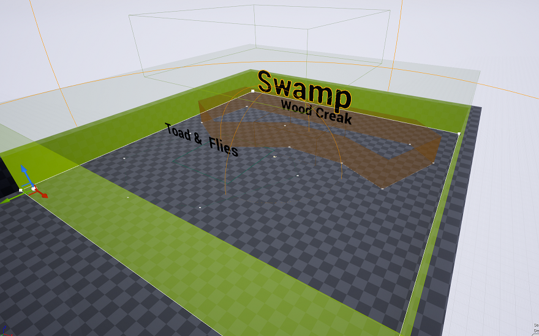
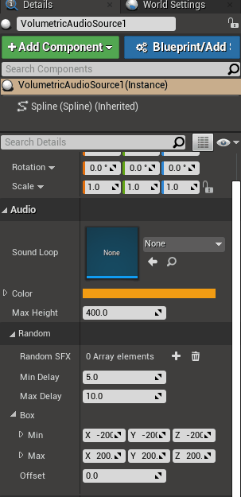
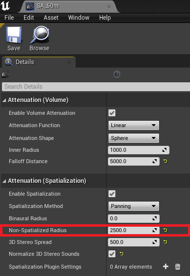
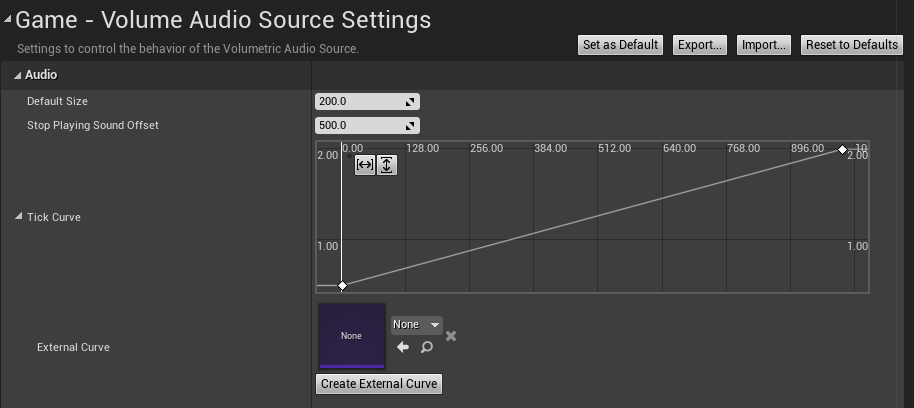
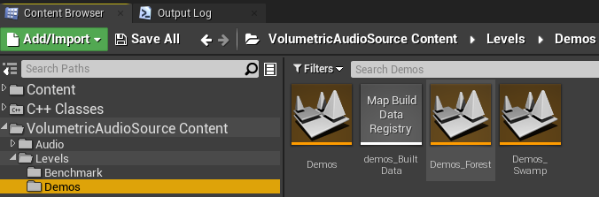

# Volumetric Audio Source
Volumetric Audio Source is an easy to use plugin to play sounds from a free form shape.

The sound will follow the edge of the shape when the listener is outside and it will follow the listener when it is inside. On top of this main feature you also have the possibility to add random SFX which will play around the closest point.
# Installation

Download the last source code: 

https://github.com/SuperNeon/VolumetricAudioSource/archive/refs/heads/main.zip

Unzip in the plugins folder in your unreal project.

# Guide
* ## Usage

**Step 1.** Drag & Drop the Volumetric Audio Source

**Step 2.** Set the sound loop

**Step 3.** Play!

Note: for a better result make sure your attenuation settings have a Non-Spatialized Radius

* ## Settings

**Tick Curve** Set the tick intervale of the Volumetric base on the distance between the closest point and the listener.

* ## Examples

See Demos map in the content browser.

* ## Details

**Sound Loop** Sound which will play on the closest point.

**Color** Color of the shape. helpful to identify easily in the map the volumetric.

**Max Height** How much high is the volumetric.

**Random SFX** Array of sound to play in the box.

**Min delay** Minimum delay before playing the next random SFX.

**Max delay** Maximum delay before playing the next random SFX.

**Box** Box where the random SFX will play.

**Offset** Offset of the box from the closest point on the Z-Axis.

* ## Console commands

Commands     | Description
------------ | -------------
**au.Volumetric.Visualize** | 1 to draw the volumetrics in runtime
**au.Volumetric.Preview** | 1 to preview in edit mode
**stat Audio** | Toggles displaying audio statistics. See Volumetric Audio Source

# Known limitations
Concave shape will make the sound jumping between 2 closest positions.

# License
Volumetric Audio Source is licensed under the MIT License, see [LICENSE.txt](LICENSE.txt) for more information.

# Audio Assets
Thanks to [Arnaud Noble](https://twitter.com/Noble_Arnaud) for providing the awesome audio assets for free :notes: